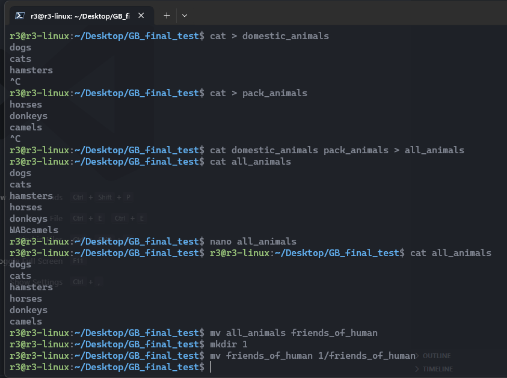
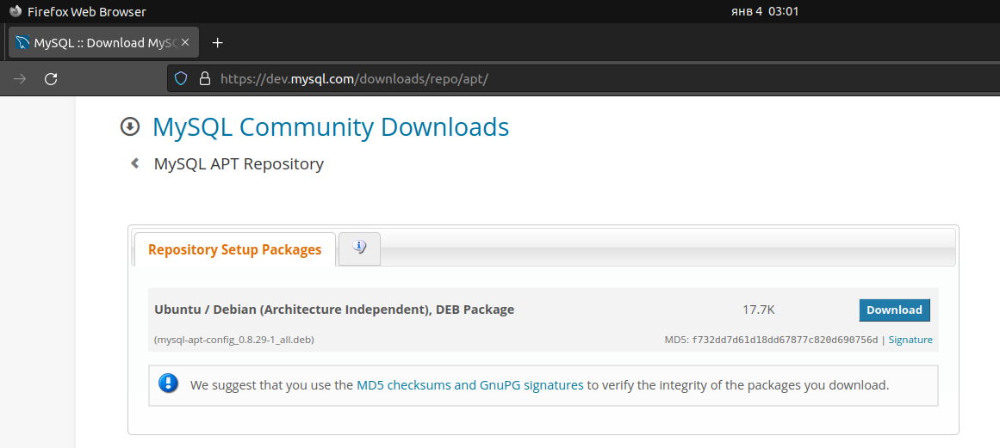
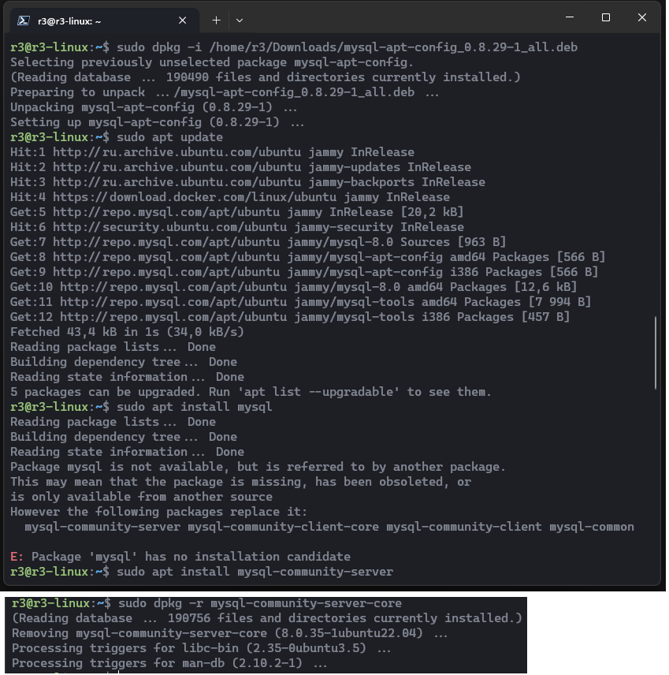
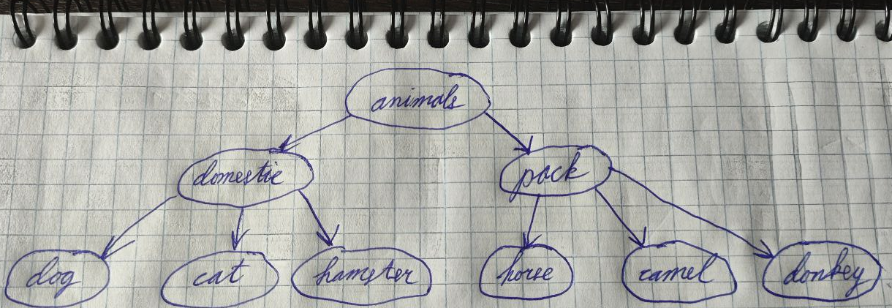

1. Используя команду cat в терминале операционной системы Linux, создать
два файла Домашние животные (заполнив файл собаками, кошками,
хомяками) и Вьючные животными заполнив файл Лошадьми, верблюдами и
ослы), а затем объединить их. Просмотреть содержимое созданного файла.
Переименовать файл, дав ему новое имя (Друзья человека).
2. Создать директорию, переместить файл туда.
3. Подключить дополнительный репозиторий MySQL. Установить любой пакет
из этого репозитория.
4. Установить и удалить deb-пакет с помощью dpkg.
5. Выложить историю команд в терминале ubuntu
6. Нарисовать диаграмму, в которой есть класс родительский класс, домашние
животные и вьючные животные, в составы которых в случае домашних
животных войдут классы: собаки, кошки, хомяки, а в класс вьючные животные
войдут: Лошади, верблюды и ослы).

